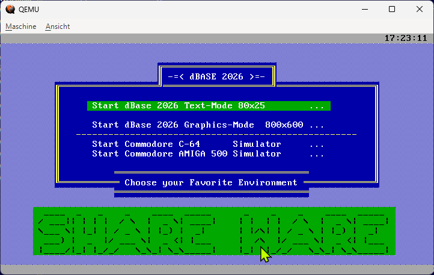
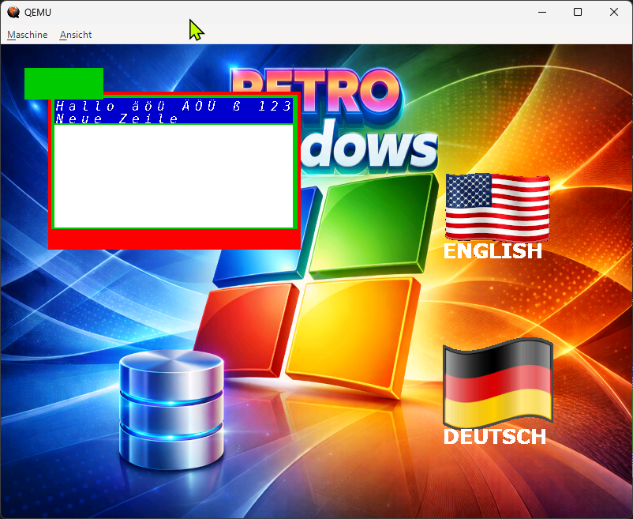
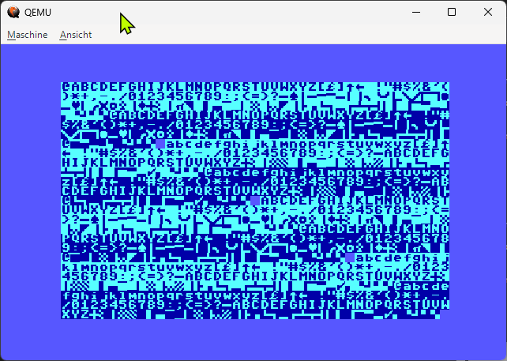
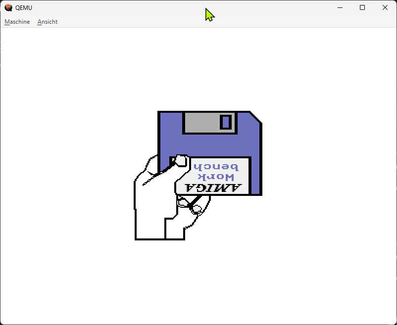

# WelcomeBackOS – Bootloader & 32-Bit Kernel Build from Scratch
(c) 2025, 2026 Jens Kallup – paule32
Alle Rechte vorbehalten.

 <br>
 <br>
 <br>
 <br>

## Current System Status: 2025-12-14

## 1️ Bootprozess: Stage 1 & Stage 2 erfolgreich implementiert
### Stage 1
- Real-Mode Bootsektor
- INT 13h Extensions (EDD) Tests
- LBA-Read Tests
- Laden von Stage2
- BIOS Debug-Ausgabe

### Stage 2
- Läuft bei 0x0000:0500
- Setzen der Segmente
- Laden des Kernels via LBA
- A20 aktiv
- GDT aufgebaut
- Protected Mode aktiviert
- Kernelstart bei 0x00010000

## 2️ Kernel
- Makefile für 32-Bit Cross-Compilation
- kernel.ld erzeugt Flat Binary
- VGA-Ausgabe funktioniert
- PM32 stabil

## 3️ Paging
- Identity Mapping der unteren 4 MiB
- Page Directory + Page Tables
- CR3/CR0 korrekt gesetzt

## 4️ Heap
- Grundstruktur implementiert
- Alignment-Fixes
- Vorbereitung auf malloc/free

## 5️ GDT & TSS
- GDT vollständig
- TSS korrekt initialisiert
- ltr erfolgreich

## 6️ Interrupts
- IDT voll aufgebaut
- Exceptions, IRQs
- PIC remapped
- Syscalls vorbereitet

## 7️ Usermode
- enter_usermode funktioniert bis ASM
- Direkter Funktionsaufruf klappt
- Ring 3 via iret in Arbeit

## 8️ ISO Boot
- Boot ohne boot-info-table
- ISO bootet korrekt
- LBA geprüft

---

## Current System Status: 2025-12-13

WelcomeBackOS now includes all foundational components of a modern 32-bit operating system.  
The following subsystems are fully implemented and functional:

---

## Bootloader (Stage1 + Stage2)

- Stage1 loads Stage2 via LBA from CD/ISO.  
- Stage2 enables A20, loads the kernel to physical address **0x0010 0000**, sets up a minimal GDT, and switches to **Protected Mode**.  
- Control is transferred safely to the 32-bit kernel.

---

## Kernel Core

- 32-bit Global Descriptor Table (GDT)  
- Fully operational Paging initialization  
- Identity-mapped kernel region  
- Stable VGA text output  
- Clean kernel execution loop using `hlt`

---

## Memory Management

### Implemented:
1. **Page Frame Allocator**  
   Bitmap-based management of physical memory pages.

2. **Kernel Heap (KHeap)**  
   With pointer-safe alignment using `uintptr_t`.

3. **Paging**  
   Page Directory + Page Tables with identity mapping of the kernel region.

This provides a stable memory foundation for higher-level kernels subsystems, such as tasking, usermode, and ELF loading.

---

## Interrupt System (IDT + ISRs)

- Complete **IDT with 256 entries**  
- Exception handlers (0–31) implemented  
- Unified `regs_t` frame passed to C handler  
- All Exceptions display debugging output  
- All Interrupt Stubs implemented in clean, structured 32-bit Assembly

---

## Syscall Framework (`int 0x80`)

- IDT entry 0x80 with **DPL=3**, accessible from usermode  
- Syscall dispatcher implemented  
- First syscall operational (VGA output test)  
- Kernel successfully handles software interrupts via a unified interface

This is the groundwork for a full system call layer and later usermode programs.

---

## Next Development Step: Hardware Interrupts (Option A)

The next milestone is implementing **hardware interrupts**, specifically:

### ✔ PIC Remapping (to 0x20–0x2F)  
### ✔ IRQ Handler API  
### ✔ Timer Interrupt (IRQ0)  
### ✔ Keyboard Interrupt (IRQ1)

These enable:

- Preemptive Kernel Scheduling  
- Task Switching  
- Usermode transitions  
- A real multitasking operating system

---

## Current System Status: 2025-12-13

Dieses Projekt zeigt Schritt für Schritt, wie man:

- einen **El-Torito CD-Bootloader** (Stage1 & Stage2) schreibt  
- einen **32-Bit Protected-Mode Kernel** lädt  
- A20 aktiviert, GDT setzt und PM startet  
- die Tools **NASM**, **MinGW-w64**, **LD**, **OBJCOPY**, **xorriso** installiert und nutzt  
- ein komplettes Build-System aus **Makefile** und **ISO-Erstellungs-Script** aufsetzt  

Damit können Entwickler ein vollständiges eigenes Betriebssystem booten – auf echten PCs, QEMU, VirtualBox usw.

---
# 0. Diagramme
<pre>
0.1 Boot Flow Diagram<br>
    +----------------+
    |     BIOS       |
    | (real mode)    |
    +--------+-------+
             |
             V
    +--------+-------+
    |    Stage 1     |
    |  (0000:0000)   |
    +--------+-------+
             |
             V
    +--------+-------+
    |    Stage 2     |
    |  (0000:0500)   |
    +--------+-------+
             |
             V
+------------+----------------+
|  Load Kernel via INT 13h    |
|  Enable A20, Setup GDT      |
|  Enter Protected Mode       |
+------------+----------------+
             |
             V
    +--------+-------+
    |    Kernel      |
    |  (PM: 0x10000) |
    +----------------+
</pre>
0.2 Memory Layout Diagram
<pre>
Real Mode (1 MB Address Space)

0000:0000  +---------------------------+
           |       Stage 1             |
           |  Loaded by BIOS (2048 B)  |
           +---------------------------+
0000:0500  |         Stage 2           |
           |  Loaded by Stage 1        |
           +---------------------------+
0050:0000  |  Free real-mode region    |
           +---------------------------+

Protected Mode (32-bit linear memory)

0x00010000 +---------------------------+
           |        Kernel .text       |
           |  Entry: KernelStart       |
           +---------------------------+
0x00020000 |        Kernel .rodata     |
           +---------------------------+
0x00030000 |        Kernel .data       |
           +---------------------------+
0x00040000 |        Kernel .bss        |
           +---------------------------+
           |    Heap, Paging, etc.     |
           +---------------------------+
</pre>
0.3 Protected Mode Transition Diagram
<pre>
Real Mode
   |
   |  Enable A20
   V
+--------------------+
|   Load GDT         |
+--------------------+
   |
   | mov eax, cr0
   | or  eax, 1      ; PE bit
   | mov cr0, eax
   V
+--------------------+
|  PE active (PM)    |
+--------------------+
   |
   | Far jump to selector:offset
   | jmp 0x08:pm_entry
   V
+---------------------------+
|  pm_entry (32-bit code)   |
+---------------------------+
   |
   | Jump to kernel entry
   V
+---------------------------+
|   KernelStart @ 0x10000   |
+---------------------------+
</pre>
---

# 1. Voraussetzungen / Downloads / Installation

## 1.1 NASM herunterladen und installieren
NASM ist der Assembler für Stage1 & Stage2.

Download (Win64):  
https://www.nasm.us/pub/nasm/releasebuilds/

Installation:
1. ZIP herunterladen  
2. nach `C:\Tools\nasm\` entpacken  
3. PATH erweitern:

```
set PATH=C:\Tools\nasm;%PATH%
```

---

## 1.2 MinGW-w64 installieren (für gcc, ld, objcopy)

Download:  
https://www.mingw-w64.org/downloads/

Empfohlen: Variante “posix-seh”.

---

## 1.3 xorriso installieren

Unter MSYS2:

```
pacman -S xorriso
```

---

# 2. Bootprozess-Überblick

```
BIOS → Stage1 → Stage2 → Protected Mode → 32-Bit Kernel
```

Stage1: lädt Stage2  
Stage2: lädt Kernel, aktiviert A20, wechselt in Protected Mode  
Kernel: läuft im 32-Bit Modus

---

# 3. LBA & Sektor-Bestimmung

Nach ISO-Erstellung:

```
xorriso -indev bootcd.iso -find /kernel.bin -exec report_lba --
```

Beispiel:

```
File data lba: 0 , 38 , 23 , ... , '/kernel.bin'
```

→ LBA = 38  
→ SECTORS = 23

---

# 4. Speicherlayout & ORG

| Komponente | BIOS-Adresse | ORG    | Kommentar                    |
|------------|--------------|--------|------------------------------|
| Stage1     | 0000:0000    | 0x0000 | El Torito lädt hier          |
| Stage2     | 0000:0500    | 0x0500 | Stage1 lädt Stage2 hierhin   |
| VESA-Video | 0000:0A00    | 0x0A00 | VESA Video Mode Info Table   |
| Kernel     | phys 0x10000 | 0x0000 | Stage2 lädt Kernel → PM Jump |

---

Hier die Offsets des VESA VBE Mode Info Blocks
INT 10h, AX=4F01h

<pre>
-------------------------------------------------------
00h  uint16  ModeAttributes
02h  uint8   WinAAttributes
03h  uint8   WinBAttributes
04h  uint16  WinGranularity          ; in KB
06h  uint16  WinSize                 ; in KB
08h  uint16  WinASegment
0Ah  uint16  WinBSegment
0Ch  uint32  WinFuncPtr              ; Real-Mode Callbacks
10h  uint16  BytesPerScanLine

; Direct Color (optional / abhängig vom Modus)
-------------------------------------------------------
12h  uint16  XResolution
14h  uint16  YResolution
16h  uint8   XCharSize
17h  uint8   YCharSize
18h  uint8   NumberOfPlanes
19h  uint8   BitsPerPixel
1Ah  uint8   NumberOfBanks
1Bh  uint8   MemoryModel
1Ch  uint8   BankSize
1Dh  uint8   NumberOfImagePages
1Eh  uint8   Reserved1

; Color mask info (für Direct Color / True Color)
-------------------------------------------------------
1Fh  uint8   RedMaskSize
20h  uint8   RedFieldPosition
21h  uint8   GreenMaskSize
22h  uint8   GreenFieldPosition
23h  uint8   BlueMaskSize
24h  uint8   BlueFieldPosition
25h  uint8   RsvdMaskSize
26h  uint8   RsvdFieldPosition
27h  uint8   DirectColorModeInfo

; Physische Linear Framebuffer-Adresse
-------------------------------------------------------
28h  uint32  PhysBasePtr             ; LFB-Adresse
2Ch  uint32  OffScreenMemOffset      ; (optional)
30h  uint16  OffScreenMemSize        ; in KB

; VBE 3.0+ (optional, oft 0 wenn nicht unterstützt)
-------------------------------------------------------
32h  uint16  LinBytesPerScanLine
34h  uint8   BnkNumberOfImagePages
35h  uint8   LinNumberOfImagePages
36h  uint8   LinRedMaskSize
37h  uint8   LinRedFieldPosition
38h  uint8   LinGreenMaskSize
39h  uint8   LinGreenFieldPosition
3Ah  uint8   LinBlueMaskSize
3Bh  uint8   LinBlueFieldPosition
3Ch  uint8   LinRsvdMaskSize
3Dh  uint8   LinRsvdFieldPosition
3Eh  uint32  MaxPixelClock           ; in Hz

; 3Fh–FFh: reserviert für VBE, OEM, padding bis 256 Bytes
</pre>

---

# 5. Protected Mode Schritte

Stage2:

1. Kernel per LBA laden  
2. A20 aktivieren  
3. GDT laden (`lgdt`)  
4. CR0.PE setzen  
5. Far-Jump zu 32-Bit Code  
6. Sprung zu Kernel bei physisch `0x00010000`

---

# 6. Makefile & Buildsystem

Dieses Projekt verwendet ein umfangreiches Makefile (siehe Repository).

---

# 7. ISO-Erstellung

Script `create_iso.sh`:

```
xorriso -as mkisofs -o bootcd.iso     -b boot1.bin     -no-emul-boot     -boot-load-size 4     .
```

**Wichtig:** Kein `-boot-info-table`, sonst wird boot1.bin beschädigt.

---

# 8. Ergebnis

Ein vollständiger Bootprozess:

- Stage1 → Stage2 → Protected Mode → Kernel  
- Vollständiger 32-Bit Systemstart  
- Debug-/LBA-Erkennung  
- Reproduzierbar auf jedem System

---

# 9. Lizenz

(c) 2025 Jens Kallup – paule32.
